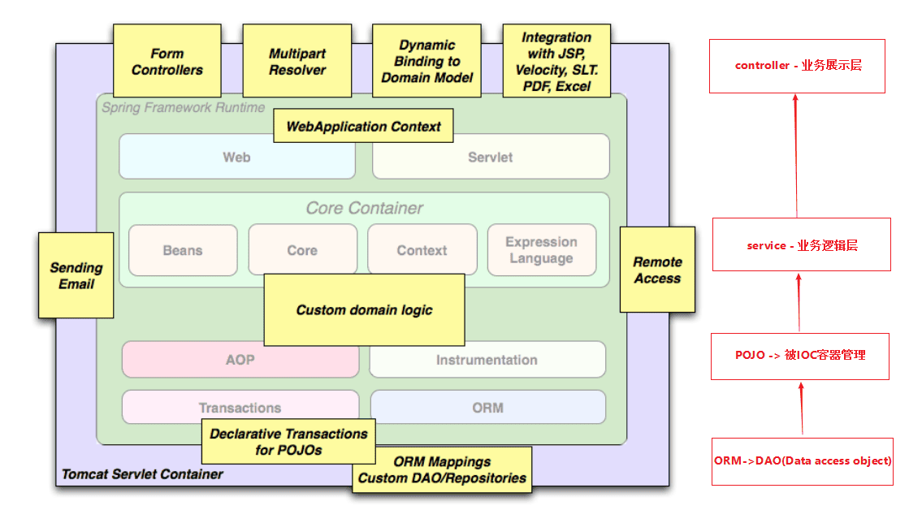

# SpringBoot入门 - 对Hello world进行MVC分层

## 经典的MVC三层架构

三层架构(3-tier application) 通常意义上的三层架构就是将整个业务应用划分为：表现层（UI）、业务逻辑层（BLL）、数据访问层（DAL）。区分层次的目的即为了“高内聚，低耦合”的思想。

1. 表现层（UI）：通俗讲就是展现给用户的界面，即用户在使用一个系统的时候他的所见所得。

2. 业务逻辑层（BLL）：针对具体问题的操作，也可以说是对数据层的操作，对数据业务逻辑处理。

3. 数据访问层（DAL）：该层所做事务直接操作数据库，针对数据的增添、

## 用Package解耦三层结构

通俗来讲就是

- controller 用来存放请求的接口
- dao用来存放数据传输的实体类
- entity 对应数据库中数据表的实体类
- service 用来实现业务逻辑 包括增删查改操作

